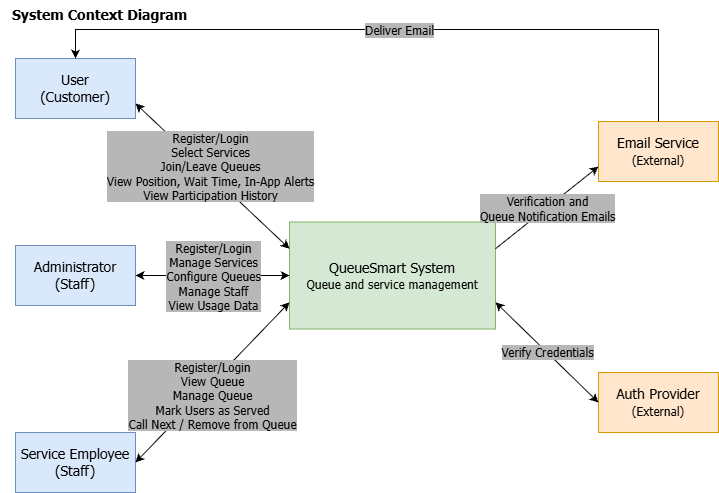

# Team 39 Assignment 1

Megan A Cowan, Charles Mccallum, Pete Sankar, Tommy Truong

## Overview

We're building QueueSmart as a web app.

## 1. Initial Thoughts

### Who uses it

**Users** - people who need to join a queue or book an appointment, they see their position and estimated wait time (time range as 10-30 mins left), receive notifications as their turn approaches. Users also see how many people are in front of them (names not shown).

**Employees** - staff can pop users from the queue once they are served without having authority to modify the services/queues properties like description, size, priorities, etc.

**Administrators** - who manages the queues, monitors priorities, review usage info, and be able to modify users. They can also create/delete queues for different services.

### How they'll use it

**Users** - First they register and log in, they will then view available services and the option to view available queues or appointments and then book either option. They will see their position, estimated wait time, and further information for that specific queue, and an option to leave the queue. They can also see in-app notifications and opted-in for email notifications with updates.

**Employees** - They can view the queue and pop users from the queue once they are served, but do not have authority to manipulate services/queue properties like descriptions, max size, priorities, etc.

**Administrators** - They have a premade log in, and have access to their specific permission to view and modify services, define queue/service properties, manage usage. They can customize queue features like max size and priorities. They can also customize the message/notification/email sent upon someone reaching the end of the queue, including both the contents and when it gets sent, or under what conditions, such as once someone reaches a certain place in the queue. They can also add text, links, or images to the end of the queue, and add text or images to the waiting area of the queue. Notifications can also be customized based on service.

### Important features

- Login and registration
- Roles
- Dashboard Management for Services and Queues
- Creating/deleting multiple queues for different services
- Joining/leaving queues
- Selecting which service they need
- Queue position, estimated wait time range, priority
- Number of people in front of the user, with names obscured/not shown
- Notifications
- In-app messages and email notifications
- Customizable notifications based on service
- Customizable notification contents and timing
- Customizable queue features like max size and priorities
- Text, links, or images in the waiting area or at the end of the queue
- Employees/Staff can pop users from the queue once served
- Queue & Service history
- Monitor queues and view usage data

### Anticipated challenges

- Long queues
- Notification timing
- Inaccurate wait times
- Keeping queue position and estimated wait time updated as users join, leave, or are served
- Managing different role permissions
- Managing priorities while keeping the queue fair

## 2. Development Methodology

We plan to use Agile, with a light version of Scrum. Each assignment is one sprint. At the start of a sprint we meet, split the work into small tasks, and each person picks tasks. We check in over group chat during the week and meet again before the deadline to review everything together.

This fits the project because the requirements come in pieces (design, UI, API, data, then the final build), and we expect to change earlier decisions as we learn more. Working in short sprints lets us adjust without redoing a big upfront plan. Our team is also small and has different class schedules, so short check-ins work better for us than long formal meetings.

Across assignments, each sprint builds on the last one. At the end of each assignment we look at what went well and what didn't, and carry any unfinished or changed items into the next sprint. Tasks are tracked in GitHub so everyone can see who is doing what, and so each person's contribution shows up in the commit history.

## 3. High-Level Design and Architecture

### 3.1 System Context Diagram

This diagram shows QueueSmart as a single system, the people who use it, and the outside systems it depends on.

- **Users** register and log in, pick a service, join or leave a queue, and see their position, estimated wait time, in-app alerts, and history.
- **Service Employees** log in, view the queue for their service, call the next person, and mark people as served or remove them.
- **Administrators** log in, create and manage services, configure queues, manage staff, and view usage data.
- **Email Service (external)** - QueueSmart decides when an email is needed (account verification, or a queue notification) and hands it to the email service, which delivers it to the user. In-app alerts stay inside QueueSmart.
- **Auth Provider (external)** - QueueSmart passes login credentials to the auth provider to verify them, so we do not handle password checking ourselves.

Everything else, including queues, priorities, wait time estimates, history, and in-app notifications, is inside the QueueSmart boundary. No implementation details are shown at this level.

### 3.2 Container Diagram

This diagram opens up the QueueSmart box from 3.1 and shows its main parts.

- **Web App (frontend)** - All three roles use the same web app. It shows different screens depending on the role, and sends every action to the backend as an API request.
- **API Server** - The single entry point to the backend. It checks who is logged in (using the Auth Provider), handles history requests, and forwards other work to the right component below.
- **Priority Queue Management** - Handles joining, leaving, and serving the next person. It orders the queue by priority and arrival time.
- **Service Management** - Lets administrators create, update, and list services. Queue Management uses the service's settings, such as priority level and expected duration.
- **Wait-Time Estimator** - Estimates the wait from a person's position in the queue and the expected duration of the service.
- **Notification Manager** - Decides when someone should be notified, for example when they are close to the front. It creates in-app alerts and sends queue notification emails through the Email Service.
- **Database** - Stores users, services, queue entries, and history. All backend components read from and write to it.

A typical flow: a user joins a queue in the web app, the API Server passes the request to Queue Management, and the new entry is saved in the database. The Wait-Time Estimator calculates their wait, which is shown in the web app. As people ahead of them are served, the Notification Manager sees they are near the front and sends an in-app alert and an email.

## Team Contribution Record

### Megan A Cowan

| Contribution                               | Discussion notes |
| ------------------------------------------ | ---------------- |
| *(each row is an individual contribution)* |                  |

### Charles Mccallum

| Contribution                                                 | Discussion notes                                     |
| ------------------------------------------------------------ | ---------------------------------------------------- |
| Added "Development Methodology" and the diagram explanations | Also set up the Assignment 1 document structure      |
| Edited the System Context Diagram                            |                                                      |

### Pete Sankar

| Contribution             | Discussion notes                                                                |
| ------------------------ | ------------------------------------------------------------------------------- |
| Added "Initial Thoughts" | The initial ideas and features we talked about in the first meeting on 09/02/26 |

### Tommy Truong

| Contribution                 | Discussion notes                                                                       |
| ---------------------------- | -------------------------------------------------------------------------------------- |
| Added System Context Diagram | Agreed to design the system context diagram and added it under `Assignment 1/diagrams` |

