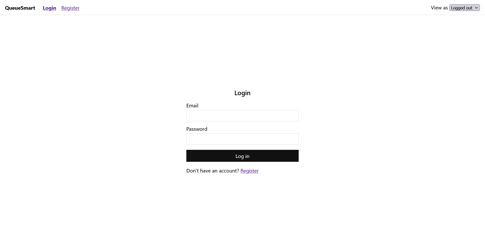
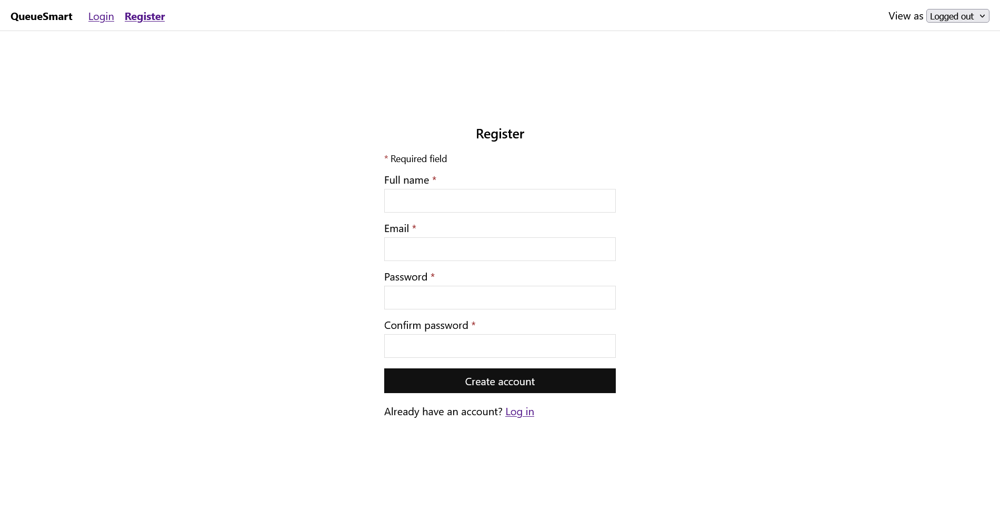
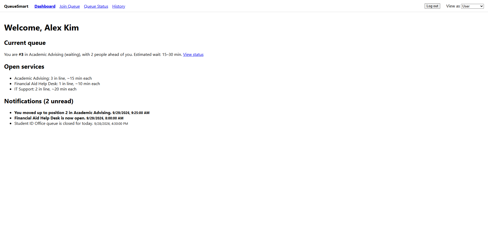
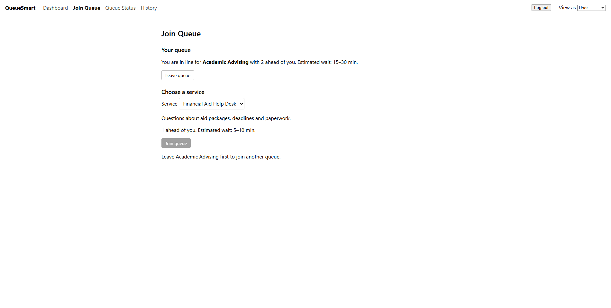
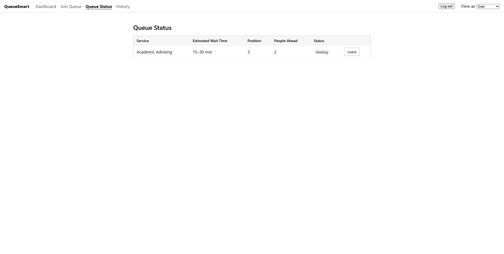
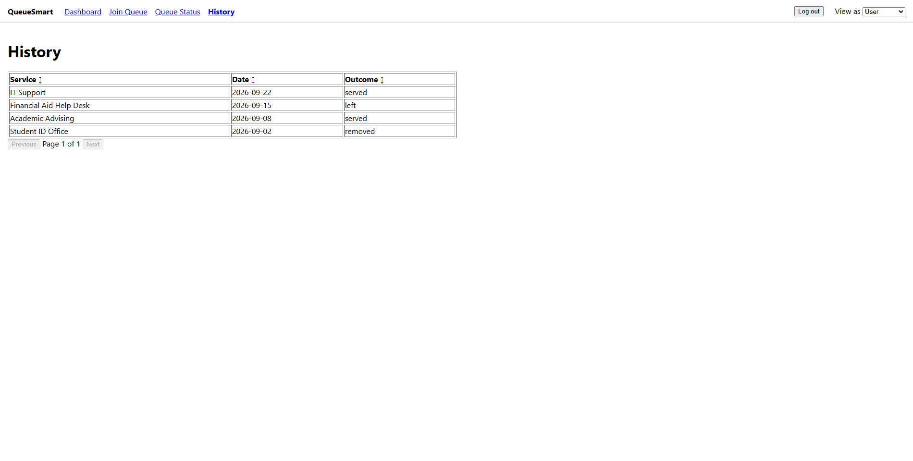
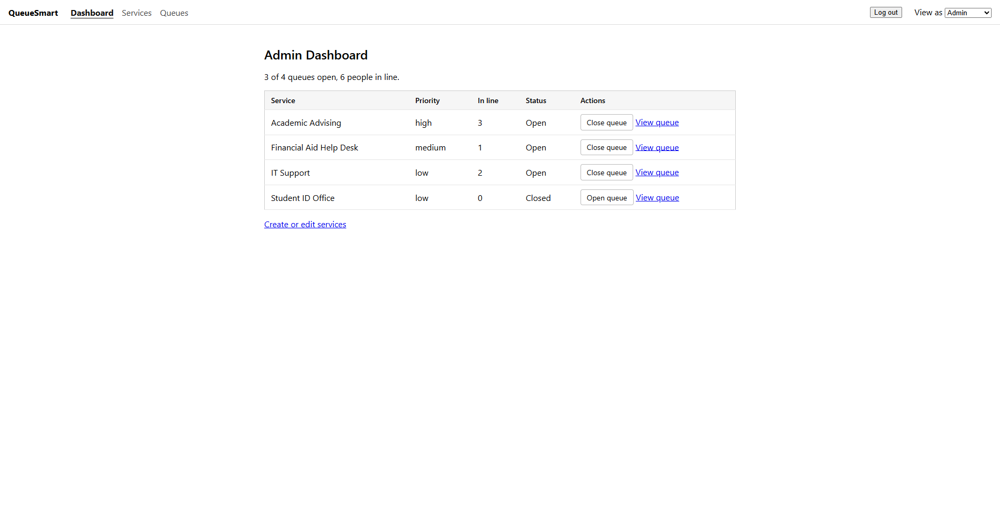
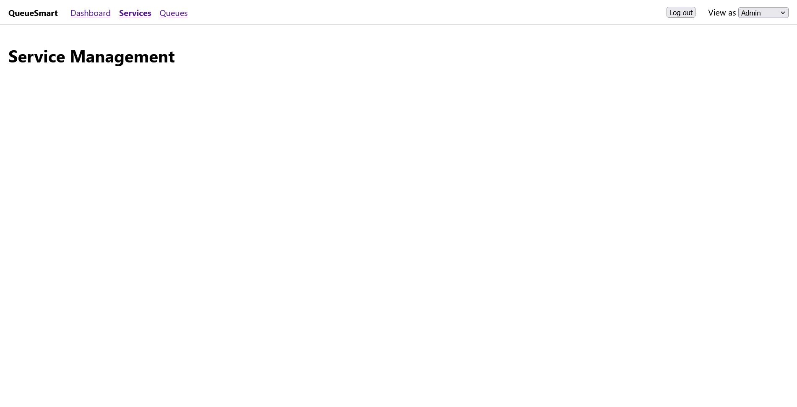
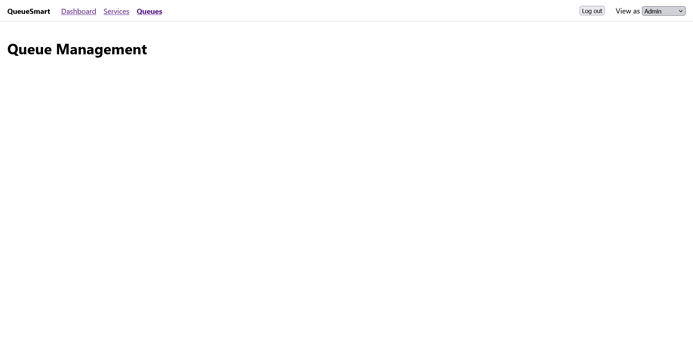
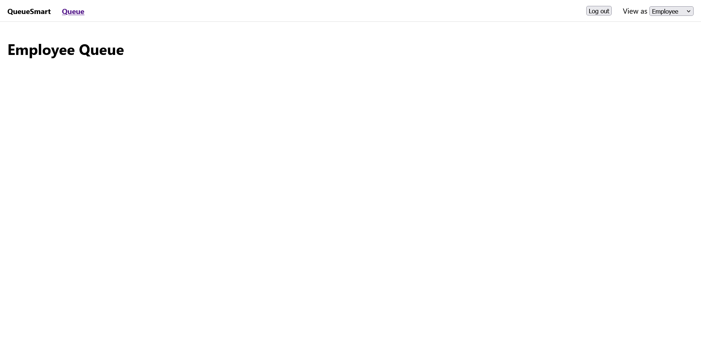

# Team 39 Assignment 2

Megan A Cowan, Charles Mccallum, Pete Sankar, Tommy Truong

## 1. GitHub Repository Link
https://github.com/tommy-truo/queue-smart

## 2. Design and Development Methodology

- Our methodology has not changed since Assignment 1. We are still using Agile with a light version of Scrum, and using a groupchat for informal updates and communication.
- We kept it because it kept us updated on each other's tasks, responsibilities, and progress, and made task delegation easier.
- We divided the UI/UX and implementation by user role. Each person owned the screens for one role and handled integration as needed.

## 3. Front-End Technologies and Responsibilities

**Technologies**

- **React** - Components let the three roles share layout and navigation. It also matches the MERN-style stack we plan to use for the backend.
- **TypeScript** - Typed data (services, queue entries) catches mistakes early and carries into the API design in Assignment 3.
- **Vite** - Fast dev server with almost no setup.
- **React Router** - Navigation between screens, and keeps each role to its own screens.

**Responsibilities**

| Screens                                     | Team member |
| ------------------------------------------- | ----------- |
| Scaffold, routing, layout, mock data        | Charles     |
| Login, Registration                         | Tommy       |
| User screens                                |             |
| Admin screens                               |             |
| Service Employee screen                     |             |
| Notifications                               |             |

## 4. Screenshots of Front End

### 4.1 Authentication Screens

**Login Screen**

 

**Register Screen**

 

### 4.2 User Screens

**User Dashboard Screen**

 

**Join Queue Screen**

 

**Queue Status Screen**

 

**History Screen**

 

### 4.3 Administrator Screens

**Admin Dashboard Screen**

 

**Service Management Screen**

 

**Queue Management Screen**

 

### 4.4 Service Employee Screens

**Employee Queue Screen**

 

## Team Contribution Record

### Megan A Cowan

| Contribution | Discussion notes |
| ------------ | ---------------- |
|              |                  |

### Charles Mccallum

| Contribution         | Discussion notes                                                  |
| -------------------- | ----------------------------------------------------------------- |
| Front-end scaffold   | Vite + React + TypeScript app with routing and placeholder pages  |
| Layout and mock data | Role-based nav, route guards and sample data                      |

### Pete Sankar

| Contribution | Discussion notes |
| ------------ | ---------------- |
|              |                  |

### Tommy Truong

| Contribution                 | Discussion notes                                                                                          |
| ---------------------------- | --------------------------------------------------------------------------------------------------------- |
| Login and registration       | Mock login and register pages with client-side validation and inline error messages                      |
| Mock accounts and session    | Seeded accounts for each role; new registrations saved in localStorage and signed in as a user           |
| Auth page styling            | Shared form styles for the login and register screens, including required-field markers                  |

